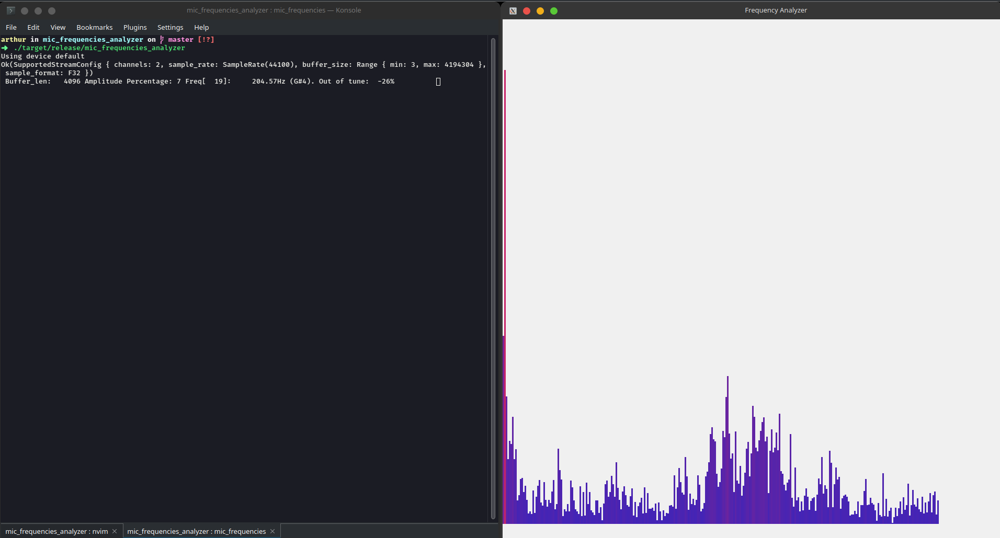
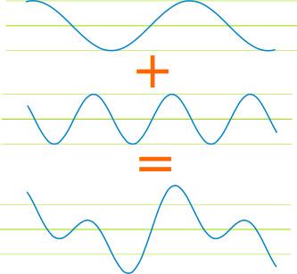
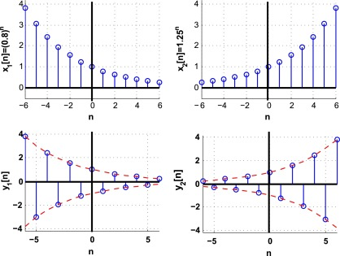
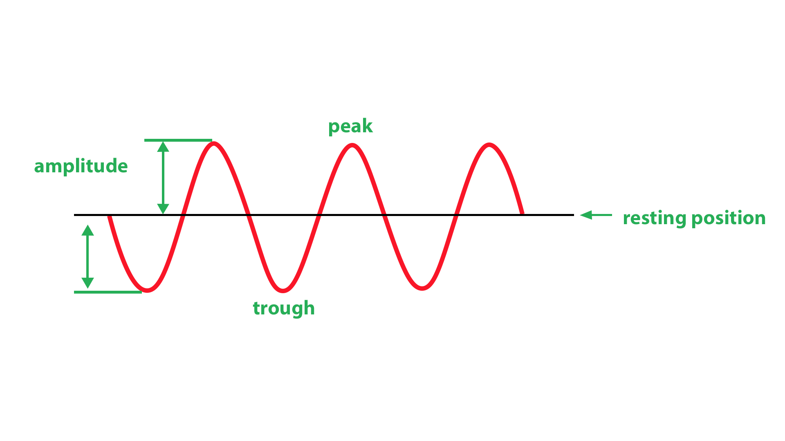

# The ultimate blazingly SLOW Rust FFT implementation :fire:



## About :computer:
This repo is meant to be a learning resource to learn the basics of FFT. I coded a simple FFT implementation used in the real world example of decomposing an audio into its frequencies.

First it gets the samples directly from the microphone in real time and then it performs the FFT to get the frequencies.

After having the frequencies, it creates a window with the raw dog sdl2 and then creates a graph and plots the resulting frequencies as well as their contribution to the final audio.


## Libraries :rocket:
1. [Cpal.rs](https://crates.io/crates/cpal) For audio capturing
2. [Sdl2.rs](https://crates.io/crates/sdl2) For drawing graphics

## How to run :clipboard:
First you need to install the sdl2. You can take a look at their [crates.io](https://crates.io/crates/sdl2#requirements) to install it.

On Ubuntu you can just run:
```bash
sudo apt-get install libsdl2-dev
```

Then you need to install the [Cpal.rs](https://crates.io/crates/sdl2) dependencies, take a look at their [crates.io](https://crates.io/crates/cpal).
On Ubuntu you can just run:
```bash
sudo apt install libasound2-dev
```
After installing the dependencies you can run it with:
```bash
cargo run
```

## Discrete Fourier Transform (DFT)
The Discrete Fourier Transform (DFT) is a mathematical operation that transform a discrete-time signal into frequency domain.

## Beginner Intuition
Any function can be written as a sum of infinite sines and cosines.
This property basically means that if we take the function
f(x) we can rewrite it as an infinite sum of sines and cosines.
Take a look at the following image:

<div align="center">



</div>

The third graph is a sum of the two graphs above it. The only problem is that given a function f(x) it's not obvious what are the many sin and cosines that compose that function.

That is why the Fourier Transform was made. But notice that I said Fourier Transform instead of Discrete Fourier Transform. That difference is because when we are talking about Fourier Transforms, we use it when we want to find the sum of sines and cosines of a function like $f(x) = log(x)$

But in a real world scenario, we usually don't have the function of a graph, instead we only have many data points. When a lot of data points is plotted to the graph it might look like the graph of a function, but it's important to note that it's not the actual function, it's just a lot of measurements of the function f(x) where x is some time. 

In these cases, where we only have the discrete-time domain(evenly spaced data points) of a function, instead of calculating a Fourier Transform, we will be calculating the Discrete Fourier Transform (DFT).

It is important that we measure the data points at evenly spaced time distances. So it's like we measured f(x) at x and then at x + 0.1 and then at x + 0.2 and then x + 0.3, and so on...

Take a look at the following images of a lot of data points evenly spaced in time.

<div align="center">



</div>

This bunch of data points is called the discrete-time domain of the function f(x). Which basically means that we have a lot of points that look just like x.

Every oscillating function (NOTE: we are going to call all oscillating function "waves" or "signals" from now on) like sine or cosine, have a phase, an amplitude and a frequency.

1. Phase: The phase is a little bit hard to explain, but it is sort of how far the function is shifted to the left or to the right.
2. Amplitude: The amplitude is the distance between the middle of the function and its highest point
3. Frequency: The frequency is how many times the function oscillate up and down for every unit of time, which could be every second or every minute, etc. If we measure how many times a function oscillate every second we can just can use the unit Hz.



You might be asking yourself, how many data points do I need in order to be able to precisely recreate a function?

The answer to that is the Nyquist–Shannon sampling theorem, which states that the minimum amount of samples per unit time needed to perfectly reconstruct a signal is at least twice of the highest frequency in the signal.

So let's say that we have a signal with a frequency of 440Hz (which corresponds to the note middle A in the piano), which means that it oscillates up and down 440 times every second. We would need to measure at least 881 data points every second in order to be able to perfectly reconstruct its function. So the sampling rate should be at least 881Hz.

Our human ear can hear frequencies up to 20_000 Hz (20kHz) so, every perfect sound recording should have at least 40_001 Hz, but since we use some anti-aliasing filters and a bunch of other stuff in audio processing, the default CD sampling rate is 44_100 Hz.

Once we have these data points we can begin to calculate the DFT of it.


## Fast Fourier Transform (FFT)
The only problem with the DFT is that it has a time complexity of n², which basically means that if we double the number of input values (n) this algorithm will take 4 times to run. If we multiply the number of values by 3, the time it takes to run this algorithm will be 9 times higher, and so on...

Even with a modern computer it would be too slow to run this algorithm and, because of that, things would be much slower.

But, we are lucky that there is a specific way to calculate the discrete Fourier transform. This specific way to calculate the DFT has a time complexity of nlog(n) and it's called Fast Fourier Transform or FFT for short.

Check out the links below to understand the formula and the intuition behind the FFT implementation.

### Note on complex numbers
***We can write a sum of a sine and a cosine as $e^{ix}$, because Euler's formula states that $e^{ix} = cos(x) + i\sin(x)$***.
To learn more about Euler's formula, you can watch [this 3blue1brown video](https://www.youtube.com/watch?v=mvmuCPvRoWQ).


## DFT Formula
Variables:
1. $s = \text{Vector containing N Sample Values}$
2. $N = \text{Number of samples}$
3. $\zeta = e^{\frac{-2{\pi}i}{N}}$
3. $f = \text{Frequency to test against}$
4. $ŝ[f] = \text{The discrete Fourier transform of the frequency }f\text{ against that signal (How much of frequency} f \text{is in the signal s)}$
 
 
Discrete Fourier Transform formula: $ŝ[f] = \sum^{N-1}_{n=0}s_{[n]}\zeta^{fn}$
 
 The output will give us an complex number with a real ($a$) and an imaginary part ($b$). The real part is the $cos$ function, and the imaginary part is the $sin$ function. These give us the phase of the frequency.
 Therefore: $ŝ_{[f]}=a + ib$


 If you just want to know whether there is or not a frequency you can calculate the magnitude (the normalized vector) $|ŝ_{[f]}|$ with the formula below: 

The following formula means that the magnitude of the complex number is equal to the square root of the sum of the square of the real part and the imaginary part(Pythagorean Theorem): 
 $|ŝ_{[f]}| = \sqrt{a² + b²}$

## To learn more about DFT, you can use these links:
If you watch the following videos and really pay attention to all their content you will understand the Discrete Fourier Transform. If you don't understand, try to learn about calculus in 3blue1brown and see the videos that are linked in the description of each video.

1. [This is a website that has a nice and friendly introduction to DFT](https://www.jezzamon.com/fourier/index.html)

1. [Must watch: 3blue1brown video about the Fourier Transform Intuition](https://www.youtube.com/watch?v=spUNpyF58BY)
1. [Must watch: 3blue1brown video about how to actually calculate the DFT](https://www.youtube.com/watch?v=g8RkArhtCc4)
1. [Must watch:Veritasium video about the DFT and about the FFT](https://youtu.be/nmgFG7PUHfo?si=dQkwTJDc7Ht0EoeH)

The next videos are good videos but only after you've watched the first videos:
1. [Matlab about the DFT and the FFT](https://youtu.be/QmgJmh2I3Fw?si=60jzWiJf29nX40n8)
1. [Reducible about the DFT](https://youtu.be/yYEMxqreA10?si=Lc0qPItuIQ6i9pnI)


## After you've learned the DFT, to learn more about FFT you can use these links:

1. [Simon Xu about the FFT](https://youtu.be/htCj9exbGo0?si=xL6jBgNIaI4O31Lh)

The following videos are not the best explanation, but these are good videos and also have an implementation of the FFT, but the implementation in the videos is wrong, read the description of the video. They were made by Reducible:
1. [Intuition video](https://youtu.be/h7apO7q16V0?si=nIwYoXWGVBNcb5pn)
1. [Runnning algorithm](https://youtu.be/Ty0JcR6Dvis?si=qVw8XtbQC-g81iYT)

